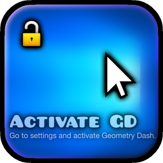
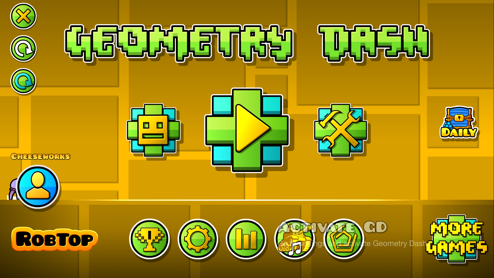
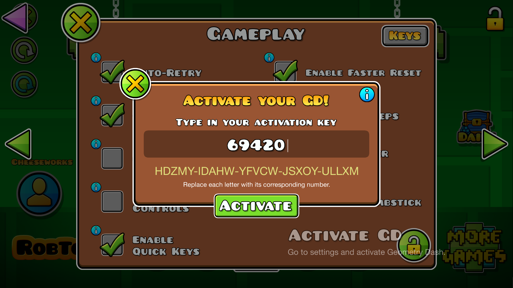

#  ActivateGD
Go to settings and activate Geometry Dash.

>   

>  
>  
> 

---

## About
A silly lil' joke mod that just adds an "*Activate Windows*"-like overlay to your game.

---

### Activating
Yes! You can actually *"activate"* your game and make the overlay disappear for your current session by going to your game settings and pressing the unlock button to start the activation process. Although, why would you even want that..?

> [!TIP]
> *gd pirata real*

---

---

### Changelog
###### What's new?!
**[📜 View the latest updates and patches](./changelog.md)**

### Issues
###### What's wrong?!
**[⚠️ Report a problem with the mod](../../issues/)**